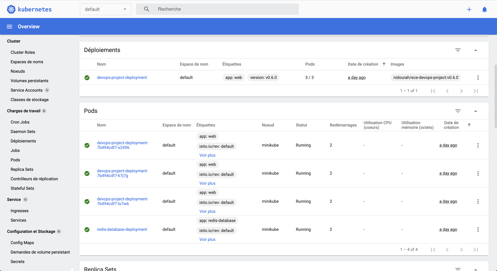

# ING4-DevOps-Project

Simple CRUD user API 

- Sign in
- Sign up 
- Edit password
- Delete account


## Table Of Contents
1. [Getting Started](#getting-started)
2. [Features](#features)   
3. [Code Practice](#code-practice)
4. [Testing](#testing)
5. [Continuous Integration](#continuous-integration)
6. [Continuous Delivery](#continuous-delivery)
7. [Environments](#environments)
8. [Health Check](#health-check)
9. [Authors](#authors)

## Getting Started 

*1/* Get the sources

```
git clone git@github.com:VincentHardouin/ING4-DevOps-Project.git && cd ING4-DevOps-Project
```

*2/* Execute the configuration script:

```
npm run configure
```

*3/* Launch [Redis](https://redis.io/) database with docker 

```
docker-compose up -d redis
```

*4/* Start the application

```
npm start
```

*5/* Access the application on http://localhost:3000

*6/* Develop and add wonderful features!

## Features
### API Features
- Create account with encrypted password stored in database
- Sign-in and are authenticated thanks to JWT Token
- Connected users can edit their password
- Connected users can delete their account
- All features are tested with Unit, Integration, Acceptance, e2e, and load tests :rocket:

### Deployments 
- IaC 
- Kubernetes with Istio 
- PaaS 

### CI/CD 
- GitHub Actions CI with also e2e tests
- Automatic `CHANLEGOG.md` based on merged PR title
- Release script with : `npm run release`
- Automatic built image on Docker Hub 
- Health-check application 

## Code practice 

### Pair Programing

We think that pair programing and mob programing are more efficient than one person programing 
and others review. 

With small delay like this project, it's also quicker and easily with this practice.  
 
### Clean Architecture 

- Controller - Use-case - Repositories
- Dependency injection to facilitate testing 

### Domain Driven Design - DDD

We used [DDD](https://blog.octo.com/domain-driven-design-des-armes-pour-affronter-la-complexite/) to develop 
our application, because we want the code should match the business domain. In our case, it's represented requirements specification.

### 12 Factors 

We used [12 factors](https://12factor.net/) methodology to develop our application.

### Craftmanship 

As possible, in this small app we used [software craftmanship](https://blog.octo.com/software-craftsmanship-une-culture-a-transmettre/) culture for develop our application. 

## Testing 

### Why ?
We are convinced by the importance of testing our app to deliver clean code in production.  

### How ?
We chose [mocha](https://mochajs.org/) and [chai](https://www.chaijs.com/) to test our app.
They are simple to use and have good documentation. 
Also, to stub and mock we selected [sinon](https://sinonjs.org/). 

### What ?
We added `mocha`, `chai`, `sinon` inside `devDepencies` in `package.json`. <br>
To simplify their usage we created `test-helper` which is useful to : 
- Export all required modules : `chai`, `sinon`, `expect`, `request`
- Export currying function `catchErr` to test errors
- Create global `afterEach` to restore stub and empty database 

Moreover, we used multiple types of tests : 
- **Unit Tests** : to test isolated functions, with stub and mock  
- **Integration Tests** : to test interaction between multiple modules, for example repositories function with database connection
- **Acceptance Tests** : to test all integration, for example API endpoint 
- **e2e Tests**: to test features in real environment like user with [Cypress](https://www.cypress.io/). 
- **load Tests**: to test load on our application with [Artillery.io](https://artillery.io)

## Continuous Integration
Continuous Integration is precious in development, we need to be confident about our code and new features. 

For the CI, we adopted [GitHub Actions](https://github.com/features/actions) to run our tests.

### Why use GitHub Actions ? 
We chose to use GitHub Actions. Indeed, when talking about small project they are simple to use and meet all our needs. Plus, GitHub Actions can easily be scalable to match our project evolution. 

### What ? 
GitHub Actions, doesn’t need third party services to be used. 
You simply need to create your workflow.

### How ?
First we used nodejs example in [GitHub Docs](https://docs.github.com/en/free-pro-team@latest/actions/guides/building-and-testing-nodejs).
To guarantee, same code convention, we have add `eslint` check in CI.
```yaml
- run: npm run lint
```
And in `package.json` : 
```json
"lint": "eslint .",
```

After having added Redis Database in our code and tested it, we need to run CI with Redis. For that, we edited the file to add services  : 
```yaml
    services:
      redis:
        image: redis
        ports:
          - 6379:6379
```
Entire workflow is [here](/.github/workflows/node.js.yml).

## Continuous Delivery

### Why ? 
This is important to have user feedback, for that we need to deliver new features as often as possible.

### How ?
Release is an important and redundant task, this is why you should automate it.<br>
For example, there are redundant to fill *`CHANGELOG.md`* for each version.

### What ? 
To achieve that, we used [npm-version](https://docs.npmjs.com/cli/v6/commands/npm-version).
On hook *`version`*, script get merged pull request titles from last release and add it in *`CHANGELOG.md`*.
Also, tag using [SemVer](https://semver.org/) is created and pushed to GitHub.

Finally, for deployment, Scalingo triggers master branch changes and deploys it after CI success.
In our `package.json` :
```json
    "release": "npm run release:minor",
    "release:patch": "npm version patch -m \"Release v%s\"",
    "release:minor": "npm version minor -m \"Release v%s\"",
    "release:major": "npm version major -m \"Release v%s\"",
    "preversion": "git checkout dev && git pull --rebase && npm test",
    "version": "node scripts/release/get-pull-requests-to-release-in-prod.js && git add package.json CHANGELOG.md",
    "postversion": "git push && git checkout master && git pull && git fetch -t && git merge dev --no-edit && git push origin master && git push --tags && git checkout dev"
```

Also, for Kubernetes, on Docker Hub, we used automated builds for build our new image version. 


## Environments

### IaC

We thought about how build our infrastructure with IaC. 

First, we think about Node JS App and Redis on the same server, or vps, but this is not scalable.


**This is not scalable** because, Redis Database, should not have the same data on each server. 

Thus, we decide to build playbook dedicated in first part for Node Js App and in the second part for Redis Database. 

For that, we have created to host : `web` and `database`, with that we can scale easily `web` host.

This can be represented by : 


Our playbook can be found [here](IaC/playbook.yaml)

Also, we created small tests for IaC [here](IaC/test)

For web host : 
```ruby
describe port(3000) do
  it { should be_listening }
end

describe command('ps aux | grep node | grep -v grep') do
  its(:stdout) { should contain('node') }
end

describe command('ps aux | grep pm2 | grep -v grep') do
  its(:stdout) { should contain('pm2') }
end

```

For database host :
```ruby
describe port(6379) do
  it { should be_listening }
end

describe process("redis-server") do
  it { should be_running }
end
```

### IaaS Approach with Kubernetes

#### Create Dockerfile 

1. First step choose based on the image : `node:12.19.1-alpine`. Why alpine ? Because image is lighter and already necessary
tools are installed
2. Create Workdir and copy `package.json`, and `package-lock.json`
```Dockerfile
WORKDIR /usr/src/app

COPY package*.json ./
```
3. As we have alpine image we need to install tools for run `npm ci`, but we removed this after installation : 
```Dockerfile
RUN apk add --no-cache --virtual .gyp \
        python \
        make \
        g++ \
    && npm ci \
    && apk del .gyp
```
4. Copy app files, but just necessary thanks to `.dockerignore` : 

Dockerfile : 
```Dockerfile
COPY . .
```
5. Expose Port and command to start image :
```Dockerfile
EXPOSE 3000

CMD [ "npm", "start" ]
```

Entire file is available [here](Dockerfile)

#### Build Dockerfile and push on Docker Hub 

```shell
docker build -t nidourah/ece-devops-project .
```

```shell
docker push nidourah/ece-devops-project
```

#### Docker-compose for local usage 
```yaml
version: '3'

services:
  redis:
    image: redis:5.0.7-alpine
    ports:
      - "6379:6379"

  web:
    build: .
    ports:
      - "3000:3000"
    environment:
      DATABASE_REDIS_URL: redis://redis:6379
```

#### Kubernetes deployment 
We choose to use same approach than IaC, with more scalability. 

For that, we created separated deployment for [Node App](k8s/deployments/node-app-deployment.yaml) and 
[Redis Database](k8s/deployments/redis-deployment.yaml). 

We added 2 services, one for load balancing [Node App](k8s/services/node-app-service.yaml) and another for 
[Redis](k8s/services/redis-service.yaml).

And for Redis we also created [PersistentVolumeClaim to save data](k8s/volumes/redis-volume.yaml).

Finally, with 3 simple commands we have Kubernetes deployment : 

```shell
kubectl apply -f k8s/deployments
kubectl apply -f k8s/services
kubectl apply -f k8s/volumes
```

Result : 


#### Istio 

We also installed Istio with default profile : 
```shell
istioctl install
```

And activate option to add automatically sidecar for container in pods with : 
```shell
kubectl label namespace default istio-injection=enabled --overwrite
```

1. Create [DestinationRule](k8s/istio/destination-rules.yaml) for older version (v0.5.0) et new version (v0.6.0)
2. Create traffic shifting with [VirtualService](k8s/istio/virtual-service-50-v050-v060.yaml)
3. For test traffic shifting with used, load testing with [Artillery.io](https://artillery.io/), and the 
   [test created](high-level-tests/benchmarking/index.yaml)
   To show the result, we used [Grafana](https://grafana.com/) and [Kiali](https://kiali.io/) :
   
   Kiali Graph Traffic Shifting : 
   
   
   Grafana Service WorkLoads:
   

   
### PaaS Approach

This project is deployed on [Scalingo](https://scalingo.com/) platform. 

#### Why use Scalingo ? 
We chose to use Scalingo as it is French PaaS using [Outscale](https://fr.outscale.com/), a French IaaS. 
Outscale is a subsidiary of Dassault Systèmes.  

#### How ?
Scalingo is based on [Heroku](https://www.heroku.com/home). Both detect `package.json` at root of project, 
you can also choose your buildpack if you prefer.

#### What ? 
For Production and Staging, we just add an addon for [Redis](https://redis.io/) Database, and provide environment variable : 
`DATABASE_REDIS_URL=` 

For Review Apps, we play it different and add `scalingo.json` file to explain the configuration we want.
In our case we want Redis addon and provide environment variable. It looks like this :
```json
{
  "name": "DevOps Project Review App",
  "env": {
    "DATABASE_REDIS_URL": {
      "description": "",
      "value": "$REDIS_URL"
    }
  },
  "addons": [
    "redis:redis-sandbox"
  ],
  "formation": {
    "web": {
      "amount": 1,
      "size": "S"
    }
  }
}
``` 


|Environment | Website|
|:---:|---| 
|Production | https://ing4ecedevops-production.osc-fr1.scalingo.io|
|Integration | https://ing4ecedevops-staging.osc-fr1.scalingo.io|
|Review App | https://ing4ecedevops-staging-pr<Number>.osc-fr1.scalingo.io|

 
## Health Check

### Why ? 

Create and deploy an application is great but if users can't use it, it's useless. 

### How ? 

To guarantee user access, we need to have a health check dashboard for all our environments.

### What ? 

For such needs, we chose [Gatus](https://github.com/TwinProduction/gatus) and deployed it on [Heroku](https://www.heroku.com/home).
We used Heroku rather than Scalingo because it is important to have health check in another platform/server/region. Indeed, if you do not split your environment, and your cloud provider is having troubles, your health check is also impacted. 

#### Deployment on Heroku
To deploy [Gatus](https://github.com/TwinProduction/gatus) on Heroku, we created `Dockerfile` and `heroku.yml` to specify Heroku to use `Dockerfile` for building the application :

Dockerfile : 
```Dockerfile
FROM twinproduction/gatus
ADD config.yaml ./config/config.yaml
```

heroku.yml: 
```yaml
build:
  docker:
    web: Dockerfile
```

Also, we create config file : 

```yaml
web:
  port: ${PORT} 
services:
  - name: DevOps Project PaaS - Production
    group: core
    url: "https://ing4ecedevops-production.osc-fr1.scalingo.io/"
    interval: 30s
    conditions:
      - "[STATUS] == 200"
      - "[RESPONSE_TIME] < 1000"
  - name: DevOps Project PaaS - Staging
    url: "https://ing4ecedevops-staging.osc-fr1.scalingo.io/"
    interval: 30s
    conditions:
      - "[STATUS] == 200"
      - "[RESPONSE_TIME] < 1000"
```


Now we have [Health Check on Heroku](https://ing4-devops-health-check.herokuapp.com/) : 


 
## Authors
|[](https://github.com/BBnours) | [](https://github.com/HugoPauthier) | [](https://github.com/VincentHardouin)|
|:---:|:---:|:---:|
|[Olivier Gomes](https://github.com/BBnours) | [Hugo Pauthier](https://github.com/HugoPauthier) | [Vincent Hardouin](https://github.com/VincentHardouin)|

## Grading 

| Subject                                                         |   Code    | Max. grade|Done|
|:----------------------------------------------------------------|:---------:|:---------:|:---------|
| Enriched web application with automated tests                   |   APP     |    +1     | :white_check_mark: |
| Continuous Integration and Continuous Delivery (and Deployment) |   CICD    |    +3     | :white_check_mark: |
| Containerisation with Docker                                    |   D       |    +1     | :white_check_mark: |
| Orchestration with Docker Compose                               |   DC      |    +2     | :white_check_mark: |
| Orchestration with Kubernetes	                                  |   KUB     |    +4     | :white_check_mark: |
| Service mesh using Istio                                        |   IST     |    +2     | :white_check_mark: |
| Infrastructure as code using Ansible                            |   IAC     |    +4     | :white_check_mark: |
| Accurate project documentation in README.md file                |   DOC     |    +3     | :white_check_mark: |
| Bonus : Generate automatically CHANLEGOG.md with PR title       |   BNS     |    +1     | :white_check_mark: |
| Bonus : Add e2e tests with Cypress                              |   BNS     |    +1     | :white_check_mark: |
| Bonus : Build docker image automatically                        |   BNS     |    +1     | :white_check_mark: |
| Bonus : Create Healthcheck app                                  |   BNS     |    +1     | :white_check_mark: |
| Bonus : Swagger                                                 |   BNS     |    +1     | :white_check_mark: |
| Bonus : Load testing with Artillery.io                          |   BNS     |    +1     | :white_check_mark: |
